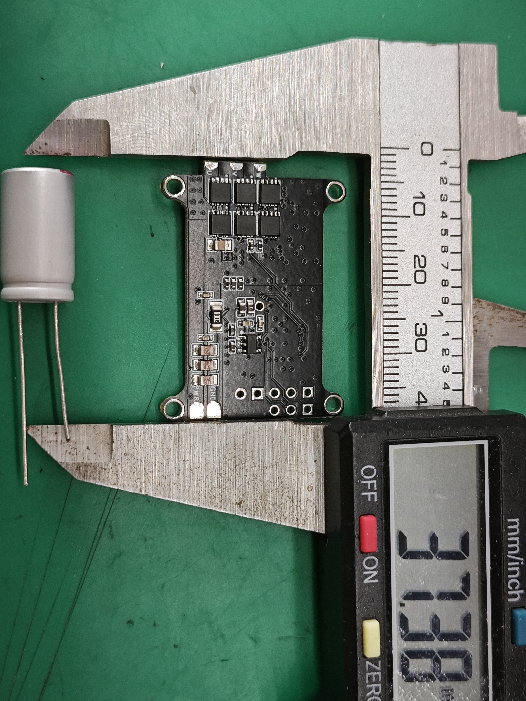
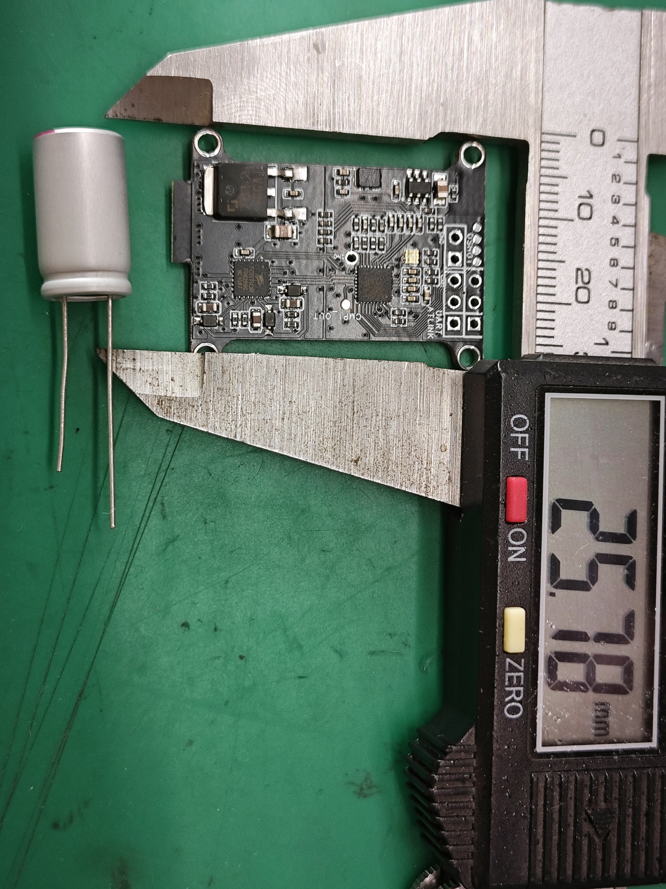

# Tiny_ESC

Tiny_ESC 是一款泛用低压三相电机驱动器，面向无感 BLDC 应用，适用于无人机 ESC、RC 小车驱动等场景。

项目文档：[https://bearshang.github.io/motor_drv-software/](https://bearshang.github.io/motor_drv-software/)

## 概述

- 泛用低压三相电机驱动器，无感 BLDC，适用于无人机 ESC，RC 小车驱动等。
- 上升沿 10ns，极小的米勒平台。
- AT32M412KBU7-4 (Cortex-M4F) 是一颗 180MHz 时脉带有浮点运算器的微控制器，双 ADC 转换器、2 个比较器、4 个运放，几乎不需要外设。
- 适合 4s~6s 电池。
- MCU 的 ADC(CMP INP) 引脚连接端电压检测，CMP INM 连接虚拟中性点，通过比较器检测反向电动势的零交越点。
- 1 个直流地母线电流检测电阻，搭配 MCU 内建 OPA 可实现单电阻电流电测。
- MCU 内建的 OPA 放大母线电流信号，可通过配置，直连内建的 CMP，构成过流保护单元，过流点可由 DAC 配置。
- 支持雅特丽原厂上位机控制、单向 DSHOT600、双向 BDSHOT600。
- 最大 29A，过流触发保护。

## 展示视频

- [测试台](docs/pics/测试台.mp4)
- [上飞机](docs/pics/上飞机.mp4)

## 项目文档

- [快速开始](https://bearshang.github.io/motor_drv-software/docs/quick-start.html)
- [原理图](https://bearshang.github.io/motor_drv-software/docs/schematic.html)
- [编译和烧录](https://bearshang.github.io/motor_drv-software/docs/build-flash.html)
- [性能调优](https://bearshang.github.io/motor_drv-software/docs/performance-tuning.html)

## 感谢

特别感谢雅特丽原厂工程师们的支持！！

## 许可证

本项目基于 [GPL-3.0](LICENSE) 许可证发布。
